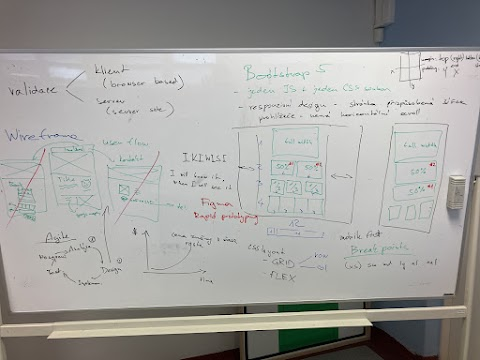

## Valudace

* Klient
    * browser based
* Server
    * Server side

## Wireframe

* Vždy webové stránky píšeme nejprve pro mobil
    * je více uživatelů co používají mobil než počítač
* I will know it, if i see it.
    * Zákazník nikdy neví co chce
    * Uvědomí si to, až to uvidí
    * Když se tak programátor dozí co chce je pozdě a stojí ho to čas
* Nejdříve zjistíme co zákazník chce -> pak uděláme nějaký wireframe, jak by to mohlo vypdat -> Až pak uděláme, testujeme a nasadíme na server

### Uspořádání 

* Nahoře vždy menu
* Pod tím Hlavní nadpis (h1) - použít pouze jednou
* Kapitoly
* Na spod kontakty a podobné věci

## Bootstrap 5

* Musíme přidat jak JS tak CSS knihovnu
* Slouží k responzivním stránkám (např přizpůsobení šířce = breakpointy)
* CSS layaut
    * Grid 
        * Má sloupc a řádky
            * Row
            * Col
    * Flex s
* 12 linií
    * Slouží k zarovnávání, aby stránka vypadala všude dobře
    * 12 kvůli tomu, že je dělitelné jak 2 tak 3 

### Breakpointy 

* Používáme je na designování w. a. na různých zařízení
* Mobile first 
    * Pro mobil je optimálí sm a níž
    * Pro pc, tablety apod md a výš
